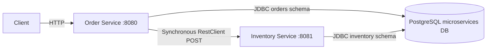
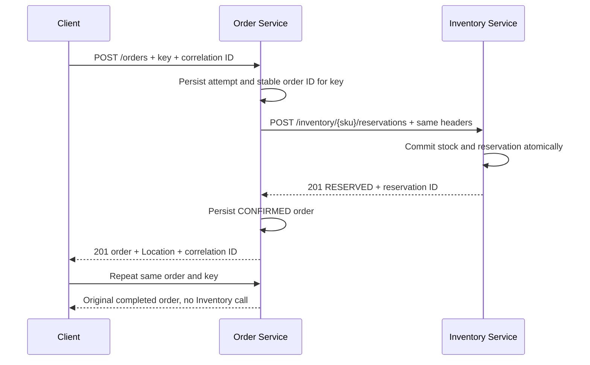
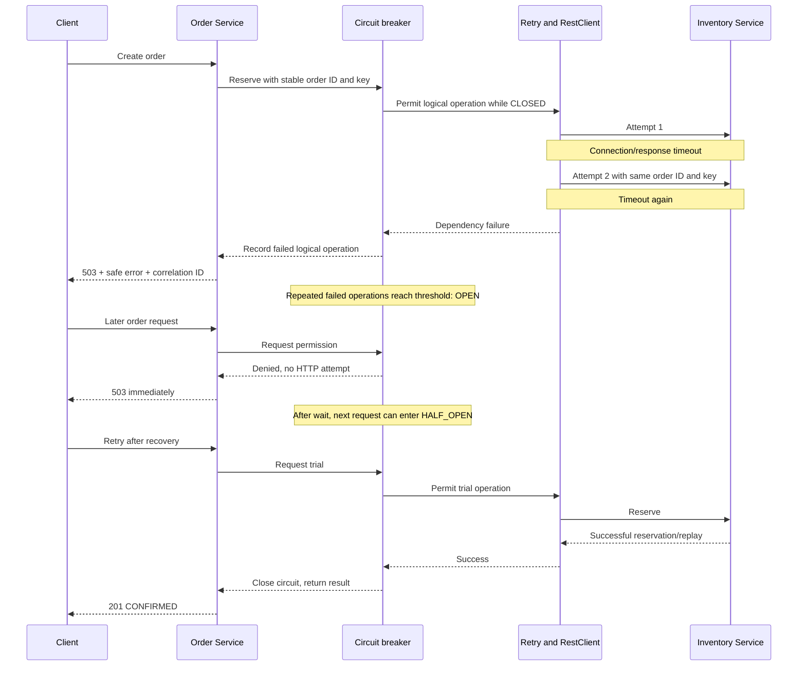

# Service boundaries

Status: implemented boundaries. Requirements below come from the exercise;
selected implementation choices are identified in the API specification.

## Ownership

| Service | Owns | Does | Must not do |
| --- | --- | --- | --- |
| Order, port 8080 | Orders, statuses, order idempotency records | Validate orders, request reservations, store confirmed/rejected outcomes, provide order reads. | Read Inventory's tables, calculate available stock, import Inventory classes. |
| Inventory, port 8081 | ProductStock, Reservations, reservation idempotency records | Find stock, enforce availability, reserve atomically, return original reservations for duplicates. | Create orders, decide customer order status, import Order classes. |

Models required by the exercise:

- Order: `id`, `customerId`, `sku`, `quantity`, `status`, optional `reservationId`, optional `rejectionReason`, `createdAt`.
- OrderStatus: `CONFIRMED`, `REJECTED`.
- ProductStock: `sku`, `availableQuantity`.
- Reservation: `reservationId`, `orderId`, `sku`, `quantity`, `idempotencyKey`, `createdAt`.

Orders and reservations have separate IDs. The order ID in a reservation is a
reference to the requesting operation; it does not give Inventory ownership of
the order. Each application defines its own DTOs even when their JSON matches.

## Communication and failure expectations

The client calls Order. Order makes a synchronous HTTP POST to Inventory using
RestClient, forwarding the idempotency key and correlation ID. Order waits for
a response or a bounded failure before responding to the client.

| Inventory result | Order behavior |
| --- | --- |
| Reservation created or successfully replayed | Store/return CONFIRMED with the reservation ID. |
| Insufficient stock | Store REJECTED with a clear reason; do not retry. |
| Unknown SKU | Store REJECTED with a clear reason; do not retry. |
| Unexpected HTTP 5xx | Retry once; return controlled 503 if still failing. |
| Too slow | Apply timeout, retry once, then controlled 503. |
| Cannot connect | Retry once, then controlled 503. |
| Circuit already open | Return controlled 503 without a remote call. |

Detailed request/response contracts and proposed edge-case decisions are in
[api-specification.md](api-specification.md).

## Why two services?

This is a learning separation between order lifecycle and stock ownership.
Each can be built, run, tested, and changed independently while preserving its
published contract. For a system this small, one application would be simpler:
local method calls, fewer deployments, simpler debugging, and potentially a
single database transaction.

The split introduces unavailable dependencies, latency, response loss, partial
completion, retries, and contract compatibility. Sharing internal models or
directly accessing another service's tables would bind deployments and allow
one service to bypass another's rules.

## Non-goals and limits

No authentication/authorization, gateway, discovery server, messaging, distributed
transaction, frontend, Kubernetes, or cloud deployment. Inventory does not call
Order back. Do not add these features to complete a fundamentals exercise.

Both services now use one durable PostgreSQL database, with separate
`inventory` and `orders` schemas and Flyway histories. Transactional stock
changes and reservation uniqueness prevent overselling. Order request locks
remain process-local; multiple Order replicas would need distributed
coordination. Production also needs retention policies, backups and an
approach to reconciliation.

A timeout is an unknown outcome: stock may already have been reserved. Repeating
the same key and order ID can recover the reservation while the original data
survives. Independent restarts or abandoned requests can still leave inconsistent
state; this exercise does not promise distributed atomicity or exactly-once
delivery.

The editable sources are [services](diagrams/services.mmd),
[successful order](diagrams/order-success.mmd), and
[unavailable Inventory](diagrams/inventory-unavailable.mmd). The previews below
are derived copies; update them from the .mmd sources when flows change.

## Service diagram

## Successful order sequence

## Inventory-unavailable sequence

